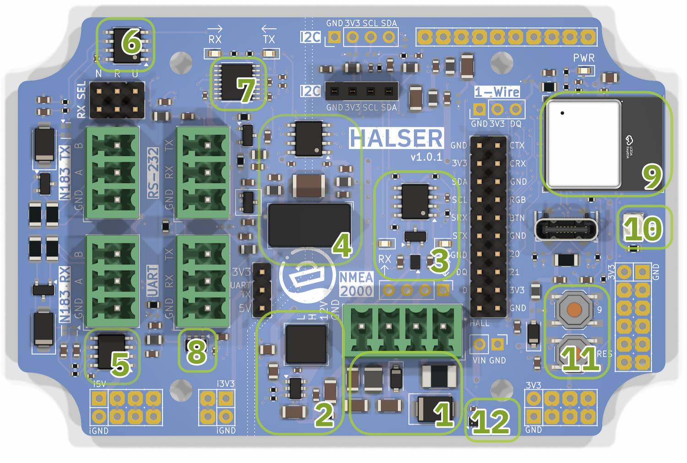
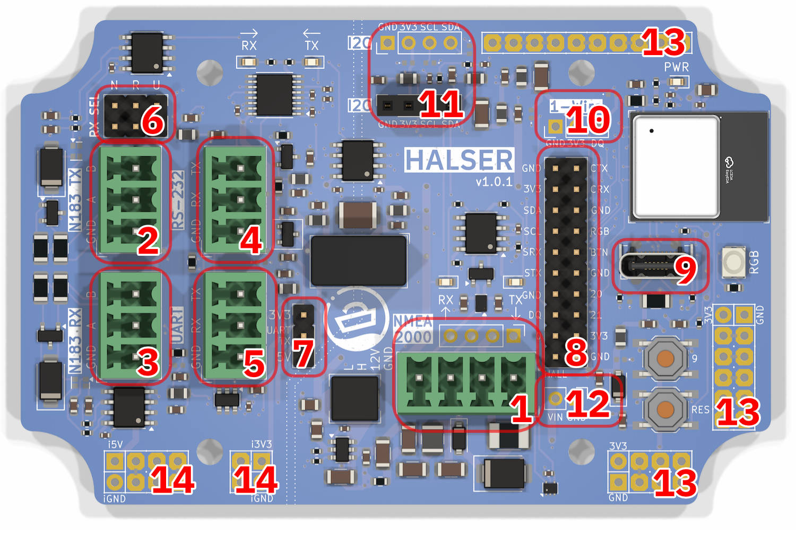
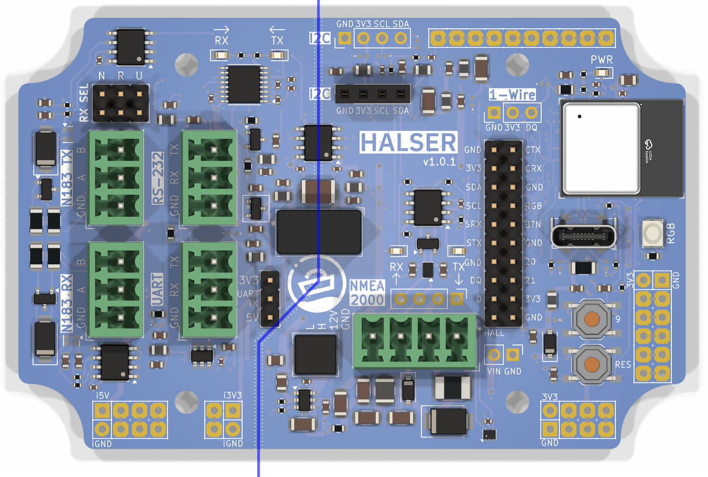

# Hardware Description

## ESP32-C3

HALSER is based on the ESP32-C3, a single-core 32-bit RISC-V microcontroller by Espressif. Key characteristics:

- **CPU:** 160 MHz RISC-V single-core processor
- **Flash:** 4 MB
- **WiFi:** 802.11 b/g/n (2.4 GHz)
- **Bluetooth:** Not available (ESP32-C3 supports BLE, but HALSER does not expose it)
- **GPIO:** 11 usable pins (see [GPIO Reference](#gpio-reference) below)

The ESP32-C3 is a popular choice for IoT applications due to its low cost, WiFi support, and compatibility with the Arduino and ESP-IDF ecosystems.

## Board Functional Blocks

1. **Power input and protection** — 5–32 V input through the NMEA 2000 connector. Protection includes a 500 mA self-resetting fuse, reverse polarity protection diode, and overvoltage/ESD protection TVS diodes with two-stage noise filtering.

2. **Switching power supply** — Converts the wide input voltage range to the 3.3 V required by the ESP32-C3 and peripherals.

3. **CAN transceiver** — Provides the physical layer for NMEA 2000 communication. Connected to the ESP32-C3 TWAI (CAN) peripheral.

4. **Isolation transformer and digital isolator** — Galvanic isolation between the serial interfaces and the ESP32-C3, preventing ground loops and providing protection against voltage spikes.

5. **RS-485 RX transceiver** — Receives differential RS-485 signals (NMEA 0183 input).

6. **RS-485 TX transceiver** — Transmits differential RS-485 signals (NMEA 0183 output).

7. **RS-232 transceiver** — Level conversion for RS-232 serial communication.

8. **UART level shifter** — Voltage translation for the UART interface. Output voltage selectable between 3.3 V and 5 V via jumper.

9. **ESP32-C3 module** — The main microcontroller with integrated WiFi antenna.

10. **RGB LED** — SK6805 addressable LED for status indication.

11. **Reset and user-defined push buttons** — Reset button pulls the ESP32-C3 enable pin low. The user button (GPIO 9) is active low with an internal pull-up and can be used for any purpose in firmware.

12. **Hall effect sensor** — On-board hall sensor (GPIO 1) that can be activated with an external magnet through the enclosure wall, providing a button-like interface without compromising the waterproof seal.

## Connectors

1. **NMEA 2000** — 4-pin pluggable terminal block (Phoenix MC 3.81 compatible). Power input and CAN bus.
2. **NMEA 0183 TX** — 3-pin pluggable terminal block. RS-485 transmit.
3. **NMEA 0183 RX** — 3-pin pluggable terminal block. RS-485 receive.
4. **RS-232** — 3-pin pluggable terminal block. Legacy serial interface.
5. **UART** — 3-pin pluggable terminal block. TTL-level serial (3.3 V or 5 V).
6. **RX selection jumper** — Selects the active receive interface (N = NMEA 0183 RS-485, R = RS-232, U = UART).
7. **UART voltage selection jumper** — Sets UART output voltage to 3.3 V or 5 V.
8. **GPIO** — 2.54 mm header breaking out available GPIO pins.
9. **USB-C** — Programming and serial communication via USB CDC.
10. **1-Wire** — 3-pin 2.54 mm header (GND, 3V3, DQ). ESD-protected and RF-filtered.
11. **I2C** (×2) — 4-pin 2.54 mm female header (GND, 3V3, SCL, SDA) and one unpopulated footprint for a second I2C connector.
12. **Vin** — Protected and filtered input voltage connector, for reusing the input power for external devices.
13. **Proto pads** — Unused pads for custom expansion.
14. **Proto pads (isolated)** — Unused pads on the isolated board section for custom expansion.

## GPIO Reference

| GPIO | Function | Notes |
|------|----------|-------|
| 0 | Available | Used as test jig indicator in default firmware |
| 1 | Hall effect sensor | On-board hall sensor |
| 2 | Serial TX | Default serial transmit. Can be remapped via GPIO matrix |
| 3 | Serial RX | Default serial receive. Can be remapped via GPIO matrix |
| 4 | CAN TX | NMEA 2000 transmit via TWAI peripheral |
| 5 | CAN RX | NMEA 2000 receive via TWAI peripheral |
| 6 | I2C SDA | I2C data line |
| 7 | I2C SCL | I2C clock line |
| 8 | RGB LED | SK6805 addressable LED data line |
| 9 | User button | User-programmable push button (active low with pull-up) |
| 10 | 1-Wire | 1-Wire data line (DQ) |
| 20 | Available | Directly available on the GPIO header |
| 21 | Available | Directly available on the GPIO header |

!!! warning "Pin Assignment Differences"
    HALSER's GPIO pin assignments differ from generic ESP32-C3 development kits. If you are adapting existing code, always verify pin assignments against this table.

## Power Supply

- **Input voltage:** 5–32 V DC
- **Input protection:** Self-resetting fuse, reverse polarity diode, TVS diodes
- **Regulation:** Switching power supply (3.3 V output)
<!-- TODO: Typical current consumption at 12V with WiFi active -->

## Galvanic Isolation

The serial interfaces (RS-485, RS-232, UART) are galvanically isolated from the ESP32-C3 and the NMEA 2000 bus. The isolation barrier runs across the board as shown below, separating the isolated serial section (left) from the non-isolated microcontroller section (right).

The isolation is implemented using a digital isolator for the serial signals and an isolation transformer for powering the isolated section. This prevents ground loops when connecting to external devices and provides protection against voltage spikes on the serial interfaces.

## NMEA 2000

NMEA 2000 is a communication standard for marine electronics based on Controller Area Network (CAN bus). HALSER's CAN interface operates at 250 kbps, the standard NMEA 2000 bit rate.

HALSER does not include a CAN bus termination resistor. If you need termination for a standalone CAN bus (not connected to a properly terminated NMEA 2000 network), add an external 120 Ω resistor between CAN H and CAN L.

## Status Indication

### Power LED

The red power LED (labeled **PWR**) is lit whenever 3.3 V power is present on the board. It indicates that the power supply is working but does not confirm that the ESP32-C3 is running.

### RGB LED

The SK6805 RGB LED (GPIO 8) is software-controlled and confirms that the ESP32-C3 is executing firmware. The default firmware uses it as follows:

- **Rainbow color cycle** — Board is running, waiting for serial data
- **Brief off-blink** — NMEA 0183 sentence received

Custom firmware can use the LED for any purpose via the Adafruit NeoPixel or FastLED libraries.

### Button

The push button (GPIO 9) is active low with an internal pull-up resistor. The default firmware uses it for SensESP device reset. Custom firmware can use it for any purpose.

## 1-Wire

The 1-Wire bus (GPIO 10) supports Dallas/Maxim 1-Wire devices such as DS18B20 temperature sensors. The HALSER implementation includes ESD protection and RF noise filtering for improved reliability in marine environments.

The 1-Wire header provides:

| Pin | Signal |
|-----|--------|
| 1   | GND |
| 2   | 3.3 V |
| 3   | DQ (data) |

## I2C

The I2C bus uses GPIO 6 (SDA) and GPIO 7 (SCL). It is available on the 4-pin I2C header for connecting external I2C devices such as sensors, displays, or additional ADCs.

The I2C header provides:

| Pin | Signal |
|-----|--------|
| 1   | GND |
| 2   | 3.3 V |
| 3   | SCL |
| 4   | SDA |
