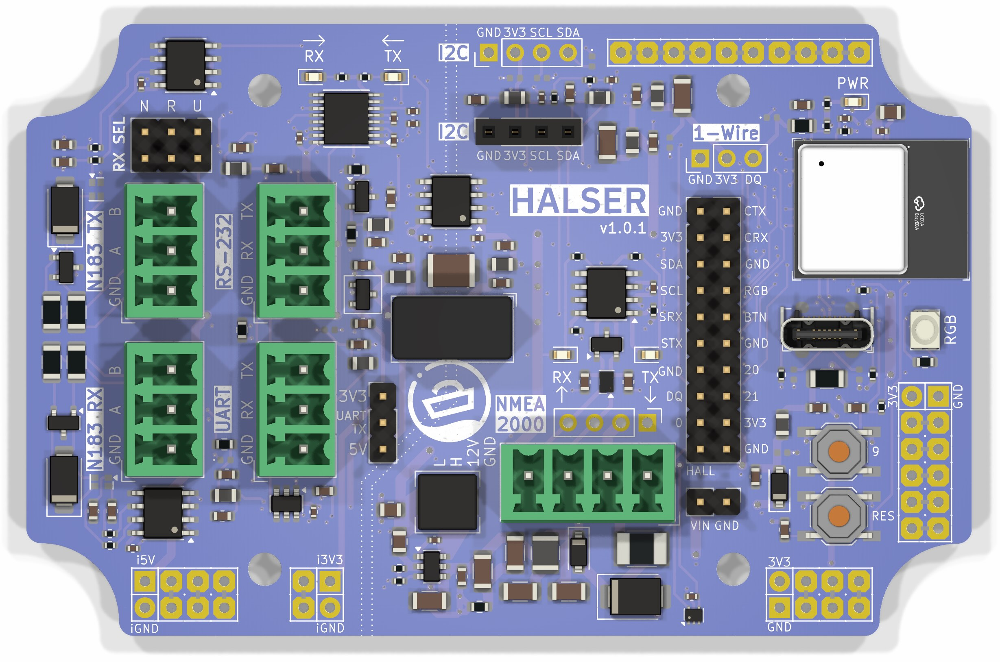

# Hardware Description

## ESP32-C3

HALSER is based on the ESP32-C3, a single-core 32-bit RISC-V microcontroller by Espressif. Key characteristics:

- **CPU:** 160 MHz RISC-V single-core processor
- **Flash:** 4 MB
- **WiFi:** 802.11 b/g/n (2.4 GHz)
- **Bluetooth:** Not available (ESP32-C3 supports BLE, but HALSER does not expose it)
- **GPIO:** 11 usable pins (see [GPIO Reference](#gpio-reference) below)

The ESP32-C3 is a popular choice for IoT applications due to its low cost, WiFi support, and compatibility with the Arduino and ESP-IDF ecosystems.

## Board Functional Blocks

<!-- TODO: Add annotated photo/diagram of the board showing functional blocks -->

1. **Power input and protection** — 5–32 V input through the NMEA 2000 connector. Protection includes a 500 mA self-resetting fuse, reverse polarity protection diode, and overvoltage/ESD protection TVS diodes with two-stage noise filtering.

2. **Switching power supply** — Converts the wide input voltage range to the 3.3 V required by the ESP32-C3 and peripherals.

3. **CAN transceiver** — Provides the physical layer for NMEA 2000 communication. Connected to the ESP32-C3 TWAI (CAN) peripheral.

4. **RS-485 RX transceiver** — Receives differential RS-485 signals (NMEA 0183 input).

5. **RS-485 TX transceiver** — Transmits differential RS-485 signals (NMEA 0183 output).

6. **RS-232 transceiver** — Level conversion for RS-232 serial communication.

7. **UART level shifter** — Voltage translation for the UART interface. Output voltage selectable between 3.3 V and 5 V via jumper.

8. **ESP32-C3 module** — The main microcontroller with integrated WiFi antenna.

9. **1-Wire interface** — ESD-protected and RF-filtered 1-Wire bus for temperature sensors and similar devices.

10. **I2C interface** — Standard I2C bus with pull-up resistors.

11. **USB-C** — USB interface for programming and serial communication. Uses USB CDC (Communications Device Class) mode.

12. **RGB LED** — SK6805 addressable LED for status indication.

13. **Button** — General-purpose push button connected to GPIO 9.

## Connectors

<!-- TODO: Add annotated bottom-side photo with jumper labels -->

### Terminal Block Connectors

| Connector | Pins | Type | Description |
|-----------|------|------|-------------|
| NMEA 2000 | 4 | Phoenix MC 3.81 compatible | Power input and CAN bus |
| RS-485 TX | 3 | Phoenix MC 3.81 compatible | NMEA 0183 transmit |
| RS-485 RX | 3 | Phoenix MC 3.81 compatible | NMEA 0183 receive |
| RS-232 | 3 | Phoenix MC 3.81 compatible | Legacy serial |
| UART | 3 | Phoenix MC 3.81 compatible | TTL-level serial |

### Headers

| Header | Pins | Pitch | Description |
|--------|------|-------|-------------|
| 1-Wire | 3 | 2.54 mm | 1-Wire bus (VCC, DQ, GND) |
| I2C | 4 | 2.54 mm | I2C bus (VCC, SDA, SCL, GND) |
| GPIO | varies | 2.54 mm | Available GPIO pins |
| UART voltage | 2 | 2.54 mm | 3.3 V / 5 V selection jumper |
| RX SEL | 3×2 | 2.54 mm | Receive interface selector (N = NMEA 0183 RS-485, R = RS-232, U = UART) |

### Bottom-Side Pads

The bottom of the board exposes additional pads:

| Pad | Description |
|-----|-------------|
| i5V / iGND | Isolated 5 V output and ground |
| i3V3 / iGND | Isolated 3.3 V output and ground |
| VIN / GND | Direct access to input power |

<!-- TODO: Verify isolated power pad usage and current limits -->

### USB

- **USB-C** — For programming (firmware upload) and serial communication. Supports USB CDC mode for virtual serial port access.

## GPIO Reference

| GPIO | Function | Notes |
|------|----------|-------|
| 0 | Test jig indicator | Reserved for production testing |
| 1 | Hall effect sensor | On-board hall sensor for production testing |
| 2 | UART1 TX | Serial transmit (directly drives RS-485 TX, RS-232 TX, and UART TX) |
| 3 | UART1 RX | Serial receive (routed to RS-485 RX, RS-232 RX, or UART RX via the RX SEL jumper) |
| 4 | CAN TX | NMEA 2000 transmit via TWAI peripheral |
| 5 | CAN RX | NMEA 2000 receive via TWAI peripheral |
| 6 | I2C SDA | I2C data line |
| 7 | I2C SCL | I2C clock line |
| 8 | RGB LED | SK6805 addressable LED data line |
| 9 | Button | User push button (active low with pull-up) |
| 10 | 1-Wire | 1-Wire data line (DQ) |

!!! warning "Pin Assignment Differences"
    HALSER's GPIO pin assignments differ from generic ESP32-C3 development kits. If you are adapting existing code, always verify pin assignments against this table.

## Power Supply

- **Input voltage:** 5–32 V DC
- **Input protection:** Self-resetting fuse, reverse polarity diode, TVS diodes
- **Regulation:** Switching power supply (3.3 V output)
<!-- TODO: Typical current consumption at 12V with WiFi active -->

## NMEA 2000

NMEA 2000 is a communication standard for marine electronics based on Controller Area Network (CAN bus). HALSER's CAN interface operates at 250 kbps, the standard NMEA 2000 bit rate.

A 120 Ω termination resistor can be enabled via a solder jumper on the back of the board. Do not enable this when connecting to a properly terminated NMEA 2000 network.

## Status Indication

### RGB LED

The SK6805 RGB LED (GPIO 8) is software-controlled. The default firmware uses it as follows:

- **Rainbow color cycle** — Board is running, waiting for serial data
- **Brief off-blink** — NMEA 0183 sentence received

Custom firmware can use the LED for any purpose via the Adafruit NeoPixel or FastLED libraries.

### Button

The push button (GPIO 9) is active low with an internal pull-up resistor. The default firmware uses it for SensESP device reset. Custom firmware can use it for any purpose.

## 1-Wire

The 1-Wire bus (GPIO 10) supports Dallas/Maxim 1-Wire devices such as DS18B20 temperature sensors. The HALSER implementation includes ESD protection and RF noise filtering for improved reliability in marine environments.

The 1-Wire header provides:

| Pin | Signal |
|-----|--------|
| 1   | VCC (3.3 V) |
| 2   | DQ (data) |
| 3   | GND |

## I2C

The I2C bus uses GPIO 6 (SDA) and GPIO 7 (SCL). It is available on the 4-pin I2C header for connecting external I2C devices such as sensors, displays, or additional ADCs.

The I2C header provides:

| Pin | Signal |
|-----|--------|
| 1   | VCC (3.3 V) |
| 2   | SDA |
| 3   | SCL |
| 4   | GND |
